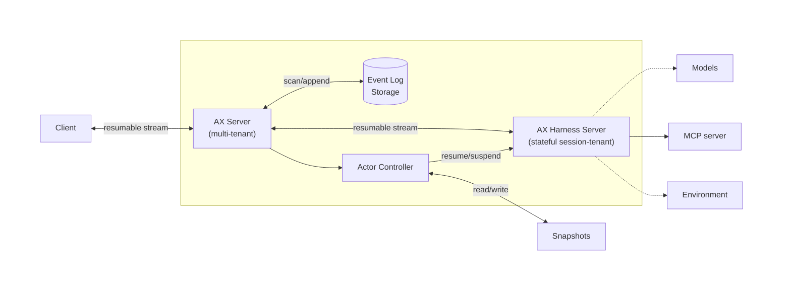

> [!IMPORTANT]
> ## 这是 AgentFleet 的硬分叉,不再跟踪上游
>
> 本仓库是 [`google/ax`](https://github.com/google/ax) 的分叉,自 **2026-08-31** 起转为**硬分叉**:
> 不再 merge、rebase 或 cherry-pick 上游任何提交。下方的原始 README 描述的是上游项目;
> 它对本仓库仍然大体适用,但**不再是权威**。
>
> ### 分支
>
> | 分支 | 是什么 |
> |---|---|
> | **`agentfleet/main`** | **本仓库真正的开发线。一切分支从这里开,一切 PR 合到这里。** |
> | `main` | 分叉点(2026-07-26,上游 `cbd2c56`)的历史镜像。**不含本仓库任何改动,请勿使用。** |
>
> ### 为什么硬分叉
>
> 上游并未停更,但它走向了与我们不同的方向(Antigravity 桌面/本地开发形态),
> 同时在一个月内三次改动了我们所依赖的接缝:`ExecutionService` 向 InteractionsService 靠拢、
> `harnessConfig` → `agentConfig` 改名、`skills.Available` → `[]skills.Group`。
>
> 与此同时,我们自己的改动 —— `harness_metadata` 字段、terminal metadata 流、
> `CloseBeforeNextStart`、COMPLETED/FAILED 双路 —— 都是 AgentFleet 的产品特性,
> 上游没有理由承担。**继续同步的代价在上升,收益接近于零。**
>
> 实际上本仓库早已事实性硬分叉:AgentFleet 一直把 `ax_ref` 钉在本仓库的具体 SHA 上,
> 且只 import 本仓库的 proto 与 client。这次只是把它明确记录下来。
>
> ### 需要上游的某个特性怎么办
>
> **阅读上游代码并自行实现,不要走 git。** 上游重写过 git 历史
> (同一提交在两边 SHA 不同),因此跨仓库的三方合并结论不可信 —— 曾经实测过一次:
> 合并带进 15 个不属于我们的文件改动,并静默丢失了上游的一处重构。
>
> ### 上游追溯
>
> 分叉点:`cbd2c56`(2026-07-26)。上游此后的提交请直接查阅
> [`google/ax`](https://github.com/google/ax)。

---

# Agent Executor (AX)

> [!WARNING]
> 🚧 **AX is in active early development.**
>
> We are actively refining our core, resumption protocols,
> and runtime specifications, which will introduce major breaking
> changes prior to a stable release.
>
> **Temporary Policy:** We are temporarily pausing the acceptance of external Pull Requests while we stabilize the core architecture. We warmly encourage you to open Issues for feedback and feature requests instead.

AX, short for Agent Executor, is a distributed harness runtime.
It dynamically provisions isolated environments from suspendable/resumable
images to execute harnesses and agents.
AX is designed for reliability, with native support for recovery
and execution resumption, even in distributed setups.

## Features

- **Distributed Runtime**: Harnesses, skills, tools, and agents can execute in isolation
- **Resumption**: Automatic recovery from failures or interruptions
- **Built-in Harnesses**: Support for frontier harnesses and custom implementations
- **Portability**: Runs anywhere, scales to small and large deployments
- **Customizability**: Bring custom environment, MCP tools, skills, instructions, and more

Built-in consistency and resumability features:
- **Single-Writer Architecture**: Single controller ensures consistent state management
- **Event Log**: Durable execution state with automatic recovery
- **Advanced Resumption**: Support for compute-layer actor resumption on compatible platforms

## Demo

[](https://www.youtube.com/watch?v=L5Iw1IrZ6Nc)

Watch our demo to see AX works when deployed on [Agent Substrate](https://github.com/agent-substrate/substrate).

## Overview



As agents evolve from simple assistants to autonomous long running workers,
developers need a robust runtime to manage state, ensure reliability,
and audit execution. As we are moving away from monolithic agents towards
distributed harnesses where tools, skills and agents are deployed as
isolated actors, a distributed runtime with dynamically spawned isolated
workers becomes a necessity. AX provides the foundational layer to fill these gaps.

While compute-agnostic, AX is aiming to provide the best
experience on Kubernetes.

We expect every sophisticated agentic application will need the
capabilities provided by AX.
We are building this layer as a widely available foundation,
enabling developers to focus on building their applications rather
than infrastructure. We decided to build this project in public to
validate every design decision before a stable release is cut.
We highly encourage you to give us feedback.

## Installation

Install the ax CLI directly from the repository:

```bash
go install github.com/google/ax/cmd/ax@latest
```

### Verify Installation

Check that ax is installed correctly:

```bash
ax --help
```

You should see the ax CLI usage information.

### Kubernetes

AX is natively supported on
[Agent Substrate](https://github.com/agent-substrate/substrate)
on Kubernetes and it's the recommended deployment option for production
use. For more details on setup and configuration, see the
[deployment guide](./manifests/README.md).
Read more about [this new layer](https://cloud.google.com/blog/products/containers-kubernetes/bringing-you-agent-sandbox-on-gke-and-agent-substrate)
that provides higher density to agentic workloads on Kubernetes.

## Authentication

The built-in Antigravity harness supports Google AI Studio and Vertex AI.

For Google AI Studio, set a Gemini API key:

```bash
export GEMINI_API_KEY="your-api-key"
```

For Vertex AI, configure Application Default Credentials and the target project
and location:

```bash
gcloud auth application-default login
export GOOGLE_CLOUD_PROJECT="your-project-id"
export GOOGLE_CLOUD_LOCATION="us-central1"
export GOOGLE_GENAI_USE_VERTEXAI=true
```

## Quickstart

The CLI starts the built-in Antigravity harness automatically. No separate harness server setup is required.

```bash
# Using the checked-in ax.yaml, which sets Antigravity as the default harness.
ax --input "Can you list this directory?"

# Executing with an AX server
ax --input "Can you list this directory?" --server localhost:8494
```

Conversations can be continued any time:

```bash
ax --conversation d85a4b4e-c53b-4c84-b879-f10d905bce40 \
   --input "Show me the contents of README.md"
```

If the client gets disconnected, pass the last step it saw to
replay the events it missed. This catches the client up; it does not
rewind the conversation.

In this example, we catch up a client from step number 12:

```bash
ax --conversation d85a4b4e-c53b-4c84-b879-f10d905bce40 \
   --last-step 12 \
   --resume
```

Instead of running the default harness, you can start executing
any registered harness:

```bash
ax --input "Can you write me a simple HTTP server in Python?"
```

If anything goes wrong during the execution of a harness,
you can resume an incomplete execution in a conversation:
```bash
ax --conversation edf98ef5-4bb1-4a9e-a091-3a77e03727e6 --resume
```


## Usage

Execute a new conversation or resume an existing one. If no conversation ID is provided, a new UUID will be generated.

```bash
ax \
    [--input <text>] \
    [--conversation <id>] \
    [--harness <id>] \
    [--config <json>] \
    [--config-file <file.json>] \
    [--server <address>] \
    [--ax-config <file>] \
    [--resume] \
    [--last-step <number>]
```

Options:
- `--ax-config`: Path to YAML configuration file (only used with a local built-in AX server) (default "ax.yaml")
- `--config`: Per-request harness configuration as an inline JSON string (mutually exclusive with `--config-file`)
- `--config-file`: Path to a JSON file with per-request harness configuration
- `--conversation`: Conversation ID (optional, generates UUID if not provided)
- `--harness`: Harness ID (optional, default harness is used if not specified)
- `--input`: Input message to send (optional)
- `--last-step`: Last step number seen by the client
- `--resume`: Resume a conversation without inputs
- `--server`: gRPC controller server address (if specified, connects to remote server; otherwise runs with a local built-in AX server)

**Examples:**

```bash
# Execute a new execution
ax --input "Hello agents!"

# Resume an existing execution with new input
ax --conversation a53d4db3-1165-4925-87da-be6c72bbdeb1 --input "Ok, now let's do something else..."

# Execute using server mode
ax --server localhost:8494 --input "Hello agents!"

# Execute with per-request harness config
ax --config '{"system_instructions":"Answer in one sentence.","model":"gemini-3.5-flash"}' \
   --input "Explain durable execution."

# To keep the same JSON in a file, use `--config-file` instead:
ax --config-file antigravity.json --input "Explain durable execution."
```

### Serve

Run the AX controller as a gRPC server. Loads configuration from a YAML file (default: ax.yaml).

```bash
ax serve [--config <path>]
```

Options:
- `--config`: Path to YAML configuration file (default "ax.yaml")

Example configuration file (`ax.yaml`):
```yaml
version: v1alpha

server:
  address: ":8494"

eventlog:
  sqlite:
    filename: "eventlog/log.sqlite"
```

Example:
```bash
# Start server with default config (ax.yaml)
ax serve

# Start server with custom config
ax serve --config my-config.yaml
```

## Extensions

### Harnesses

AX provides built-in harnesses (e.g. Antigravity) but you can bring your
own harness implementation by implementing `HarnessService`. On supported
compute services (e.g. Agent Substrate), AX automatically runs the
harness in isolation with automatic resumption and suspension.

Traditional agents (e.g. tool use or workflow agents), or
language models can be implemented as harnesses.

### Skills

Built-in harnesses like Antigravity includes built-in support for
Agent Skills. See [Skills](examples/skills) for more.

### MCP Tools

Built-in harnesses like Antigravity provides support for discovering
and making calls to MCP tools when they are configured.

## What AX is NOT?
* A managed service. AX is self-hosted and not a managed service.
  We aim to make it easy for users to deploy and operate it on
  their Kubernetes clusters.
* An agentic framework. AX is agnostic of the framework used
  to build agents.

## Roadmap

Below is an overview of our upcoming features and planned changes:

1. Support for more frontier harnesses besides Antigravity
1. Support for tool call approvals from harnesses
1. Improvements to resumption protocols
1. Forking from event log and snapshots
1. Trajectory exposition
1. Better telemetry exposition

## Contributing

Please refer to the [CONTRIBUTING.md](CONTRIBUTING.md) guide for instructions
on how to contribute to this project.

We are currently undergoing a significant architectural redesign, and external contributions are temporarily paused.
However, in the meantime, we warmly encourage you to file bugs and
send feature requests.

## History

Over the years, teams across Google built and operated several
distributed execution engines. As these systems evolved, certain
architectural patterns consistently stood the test of time.
The teams realized they were repeatedly solving similar
orchestration problems, prompting the push to extract these
lessons into common runtime layer.

While this common layer was taking shape, the AI landscape underwent
a massive shift. Applications were transitioning from
statless tool use agents to autonomous, long-running, self improving
agents that often need isolated resumable execution environments.
Also, from an efficiency standpoint, agentic workloads are inherently bursty.
An agent might compute intensively for a minute, then sit idle for
hours or days awaiting human approval. Keeping a stateful actor active
during these long idle periods is highly inefficient and cost-prohibitive
at scale.
Over the last 10 years, Kubernetes has become the standard for
large scale job orchestration, but it was fundamentally designed for
stateless microservices or predictable batch jobs --
not for suspending and resuming stateful, sandboxed agent actors.

Driven by these dual challenges, we decided to build a robust, common
agentic orchestrator designed specifically for the new compute
layers we are developing on Kubernetes. Our goal is to ease
the productionization of agents, allowing developers
and researchers to focus on building and evaluating their
applications rather than dealing with underlying infrastructure.

AX is developed and maintained by the team actively working on
Google's internal runtime. Although the two projects operate
at different layers today, we are applying our knowledge
and insights to AX in the public domain every day.

## Acknowledgements

We thank Google DeepMind for their earlier work in distributed harnesses which
heavily influenced AX.
We thank the Google Kubernetes Engine team for their deep contributions
regarding isolation, resumption and job scheduling.

## License

Apache 2.0
